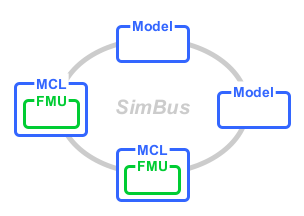
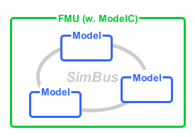
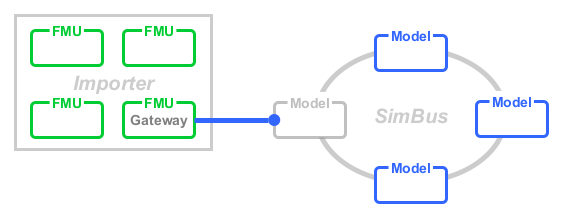

<!--
Copyright 2024 Robert Bosch GmbH

SPDX-License-Identifier: Apache-2.0
-->

# Dynamic Simulation Environment - FMI Library

[](https://github.com/boschglobal/dse.fmi/actions/workflows/ci.yaml)
[](https://github.com/boschglobal/dse.fmi/actions/workflows/super-linter.yml)


## Introduction

FMI Libraries of the Dynamic Simulation Environment (DSE) Core Platform provide various solutions for working with FMUs and FMI based simulation environments. Included are:

* FMI Model Compatability Library (MCL) - for loading FMUs into a DSE simulation.
* FMI ModelC FMU - for packaging a DSE simulation as an FMU.
* FMI Gateway FMU - for bridging between a remote simulation and a DSE simulation.
* FMI FMU - a minimal API for implementing FMUs with support for Binary Variables and Virtual Networks.

The DSE FMI libraries operate in Co-simulation environments and support both scalar and binary variables.
Virtual networks (e.g. CAN) are implemented using [Network Codecs](https://github.com/boschglobal/dse.standards/tree/main/dse/ncodec) and supported via FMI Binary variables, or in the case of FMI 2, by using encoded [FMI String variables](https://github.com/boschglobal/dse.standards/tree/main/modelica/fmi-ls-binary-to-text).


### FMI Model Compatibility Library (MCL)



* Multi platform (Linux, Windows) and multi architecture (x64, x86, i386) simulation environment.
* Native FMU support for Co-simulation.
* Virtual Networks (CAN etc.) using [Network Codecs](https://github.com/boschglobal/dse.standards/tree/main/dse/ncodec) and Binary Streams. Includes support for FMI 2 (via String variables).


### FMI ModelC FMU



* FMU with embedded Model Runtime and SimBus from the [ModelC](https://github.com/boschglobal/dse.modelc/blob/main/dse/modelc/runtime.h) project.
* Packages [DSE Simer](https://boschglobal.github.io/dse.doc/docs/user/simer/) simulation as an FMU.
* FMU interface supports Codec based Binary Streams (e.g. CAN Virtual Bus). Includes support for FMI 2 (via String variables).


### FMI Gateway FMU



* Bridge simulaiton environments using a Gateway FMU.
* Gateway FMU interface supports Codec based Binary Streams, including FMI 2 support.
* Manages the Co-simulation time-domain between the bridged simulation environments.
* Simple lifecycle which can be customised to support automation of simulation environments (e.g. session management).


#### FMI FMU

* Minimal API for implementing Co-simulation FMUs with methods:
  * `fmu_create()`
  * `fmu_init()`
  * `fmu_step()`
  * `fmu_destroy()`
* Automatic FMI Variable indexing and storage, including FMI 2 support for Binary Variables
* Build targets for FMI 2 and FMI 3.
* Virtual Networks (CAN etc.) using [Network Codecs](https://github.com/boschglobal/dse.standards/tree/main/dse/ncodec) and Binary Streams. Includes support for FMI 2 (via String variables).


### Project Structure

```text
L- dse
  L- fmigateway  FMI Gateway FMU source code.
  L- fmimcl      FMI MCL source code.
  L- fmimodelc   FMI ModelC FMU source code.
  L- fmu         FMI FMU source code.
L- extra         Build infrastructure.
  L- tools/fmi   Containerised tools.
L- licenses      Third Party Licenses.
L- tests         Unit and E2E tests.
```


## Usage

### DSE FMI Toolchains

```bash
# Build the examples.
$ make

# List the toolchains available:
$ task -l
task: Available tasks for this project:
* generate-fmigateway:      Generate a FMI Gateway FMU.
* generate-fmimcl:          Generate an FMI MCL from an existing FMU.
* generate-fmimodelc:       Generate a FMI ModelC FMU from an existing (DSE/ModelC) Simer simulation.

# FMI Gateway with the generate-fmigateway command:
$ task generate-fmigateway \
    FMI_VERSION=2 \
    SIGNAL_GROUPS="extra/tools/fmi/test/testdata/fmigateway/SG1.yaml,extra/tools/fmi/test/testdata/fmigateway/SG2.yaml"
Running FMI Toolset command: gen-gateway
Adding SignalGroup Model_1 to out/fmu.yaml
Adding SignalGroup Model_2 to out/fmu.yaml
Creating Model YAML: gateway (out/model.yaml)

# FMI MCL with the generate-fmimcl command:
$ task generate-fmimcl \
    FMU_DIR=dse/build/_out/fmimcl/examples/fmu \
    MCL_PATH=dse/build/_out/fmimcl/lib/libfmimcl.so
Running FMI Toolset command: gen-mcl
Reading FMU Desciption (dse/build/_out/fmimcl/examples/fmu/modelDescription.xml)
Creating Model YAML: fmi2fmu (out/model/model.yaml)
Running FMI Toolset command: gen-signalgroup
Reading file: dse/build/_out/fmimcl/examples/fmu/modelDescription.xml
Appending file: out/model/signalgroup.yaml


# FMI ModelC FMU with the generate-fmimodelc command:
$ task generate-fmimodelc \
    SIM=extra/tools/fmi/build/stage/examples/fmimodelc/sim \
    FMU_NAME=fubar \
    VERSION=1.0.0
Running FMI Toolset command: gen-fmu
Scanning simulation (extra/tools/fmi/build/stage/examples/fmimodelc/sim) ...
Build the FMU file layout (out/fubar) ...
Create FMU Model Description (out/fubar/modelDescription.xml) ...
Adding SignalGroup: scalar_vector (extra/tools/fmi/build/stage/examples/fmimodelc/sim/data/model.yaml)
Adding SignalGroup: network_vector (extra/tools/fmi/build/stage/examples/fmimodelc/sim/data/model.yaml)
Create FMU Package (out/fubar.fmu) ...
```


### Example: Network FMU with CAN Network Topology

The FMI ModelC FMU includes an example Network FMU which demonstrates how a
CAN Network Topology can be realised using FMI 2 String variables and a wrapped
ModelC Simulation Stack with models which implement a [Network Codec](https://github.com/boschglobal/dse.standards/tree/main/dse/ncodec).


__Network FMU Layout:__

```text
L- network_fmu             The example Network FMU.
  L- bin/fmi2importer      Importer (simple) which can run the Network FMU.
L- fmu                     FMU Package.
  L- modelDescription.xml  Model description for the FMU.
  L- lib/linux-amd64
    L- fmi2modelcfmu.so    FMU shared library.
  L- resources/sim         ModelC Simulation Stack.
    L- data
      L- simulation.yaml   Simulation Stack specification.
      L- model.yaml        Model specification.
    L- lib
      L- target.so         The ModelC model shared library.
```


__Network FMU Operation:__

```bash
# Build the DSE FMI and examples.
$ git clone https://github.com/boschglobal/dse.fmi.git
$ cd dse.fmi
$ make

# Change to the FMU directory and run the Importer/FMU.
$ cd dse/build/_out/fmimodelc/examples/network_fmu/fmu
$ ../bin/fmi2importer lib/linux-amd64/libfmi2modelcfmu.so
Importer: Loading FMU: lib/linux-amd64/libfmi2modelcfmu.so ...
ModelCFmu: Create the FMU Model Instance Data
ModelCFmu: Resource location: resource
ModelCFmu: Allocate the RuntimeModelDesc object
ModelCFmu: Create the Model Runtime object
ModelCFmu: Call model_runtime_create() ...
Runtime: Version: 2.0.24
Runtime: Platform: linux-amd64
Runtime: Simulation Path: resources/sim
Runtime: Simulation YAML: resources/sim/data/simulation.yaml
Runtime: Model: network_fmu
Load YAML File: resources/sim/data/simulation.yaml
Load YAML File: resources/sim/data/model.yaml
...
```


## Build

> Note : See the following section on configuring toolchains.

```bash
# Get the repo.
$ git clone https://github.com/boschglobal/dse.fmi.git
$ cd dse.fmi

# Optionally set builder images.
$ export GCC_BUILDER_IMAGE=ghcr.io/boschglobal/dse-gcc-builder:latest

# Build.
$ make

# Run tests.
$ make test

# Build containerised tools (more details in the extra/tools/fmi directory).
$ make build fmi tools

# Remove (clean) temporary build artifacts.
$ make clean
$ make cleanall
```


### Toolchains

The FMI Library is built using containerised toolchains. Those are
available from the DSE C Library and can be built as follows:

```bash
$ git clone https://github.com/boschglobal/dse.clib.git
$ cd dse.clib
$ make docker
```

Alternatively, the latest Docker Images are available on ghcr.io and can be
used as follows:

```bash
$ export GCC_BUILDER_IMAGE=ghcr.io/boschglobal/dse-gcc-builder:latest
```


## Developer Notes

### Debug using Simer and E2E Tests

First run an E2E test via the Makefile with modified parameters in order to get
a copy of the `sim` folder.

```bash
# Setup for running E2E tests.
$ make build fmi tools
$ export FMI_IMAGE=fmi
$ export FMI_TAG=test

# Clear out previous Testscript artefacts.
$ sudo rm -rf /tmp/tmp.*

# Run testscript with '-work' option (see Makefile target "do-test_testscript-e2e").
# Locate the "ENTRYWORKDIR" in the output for subsequent commands.
$ make test_e2e
$ make test_e2e
make: [Makefile:137: do-test_testscript-e2e] Error 1 (ignored)
Running E2E Test: tests/testscript/e2e/fmimcl_fmu2.txtar
ENTRYWORKDIR: /tmp/tmp.o37sWJbxKe
...
$ ls /tmp/tmp.o37sWJbxKe
$ sudo mv /tmp/tmp.o37sWJbxKe/sim test_sim

# Run Simer with GDB to debug a crashing FMIMCL.
$ cd test_sim
$ docker run --name simer -it --rm
    -v $(pwd):/sim
    ghcr.io/boschglobal/dse-simer:latest
        -tmux
        -logger 1
        -gdb fmu_inst
        -stepsize 0.0005
        -endtime 0.0010

# Tmux commands:
#   Ctrl-b <n> (change window)
#   Ctrl-b d (exit Tmux)
#   Ctrl+b [ (copy mode, VI movements)
#   Ctrl+b PgUp (copy mode with scroll, VI movements)
```


### Debug CLib Marshal Code

There are a copious amount of `log_trace()` statements in the marshal code which is very helpful in identifing the cause
of complex or unexpected behaviour. Code changes to the marshal code can also be tested productivly with the following process.

```bash
# Make changes to dse.clib/dse/clib/data/marshal.c.
cd dse.clib
make
make test

# Copy changes to the FMI Library for CMocka testing.
cd ../dse.fmi
sudo cp ../dse.clib/dse/clib/data/marshal.c /tmp/dse.fmi/dse.clib/dse/clib/data/marshal.c
make
make test_cmocka

# Copy changes to the ModelC Library to build a local Simer image for E2E testing.
cd ../dse.modelc
sudo cp ../dse.clib/dse/clib/data/marshal.c dse/modelc/build/_deps/dse_clib-src/dse/clib/data/marshal.c
make build simer tools

cd ../dse.fmi
make build fmi tools
export SIMER_IMAGE=simer:test
export FMI_IMAGE=fmi
export FMI_TAG=test
make test_e2e
```


## Additional Resources

The FMI Library is implemented using the following related repositories:

* [DSE Model C Library](https://github.com/boschglobal/dse.modelc)
* [DSE C Library](https://github.com/boschglobal/dse.clib)
* [DSE Network Codec](https://github.com/boschglobal/dse.standards/tree/main/dse/ncodec)
* [DSE Standareds Extensions](https://github.com/boschglobal/dse.standards)
  * [Binary Codec specification for FMI 2/3](https://github.com/boschglobal/dse.standards/tree/main/modelica/fmi-ls-binary-codec)
  * [String encoding for binary data, for FMI 2/3](https://github.com/boschglobal/dse.standards/tree/main/modelica/fmi-ls-binary-to-text)
  * [Bus Topologies and Virtual Bus/Networks, for FMI 2/3](https://github.com/boschglobal/dse.standards/tree/main/modelica/fmi-ls-bus-topology)


## Contribute

Please refer to the [CONTRIBUTING.md](./CONTRIBUTING.md) file.


## License

Dynamic Simulation Environment FMI Library is open-sourced under the Apache-2.0 license.
See the [LICENSE](LICENSE) and [NOTICE](./NOTICE) files for details.


### Third Party Licenses

[Third Party Licenses](licenses/)
