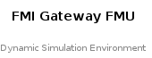

## fmu_init


In this method the required yaml files are parsed and the session is configured,
if required. The gateway is set up and connected to the simbus. After a
sucessfull connection has been established, the fmu variables are indexed to
their corresponding simbus signals.

> Required by FMU.

### Parameters

fmu (FmuInstanceData*)
: The FMU Descriptor object representing an instance of the FMU Model.

### Returns

0 (int32_t)
: The FMU was created correctly.


## fmu_step


This method executes one step of the gateway model and signals are exchanged
with the other simulation participants.

> Required by FMU.

### Parameters

fmu (FmuInstanceData*)
: The FMU Descriptor object representing an instance of the FMU Model.
communication_point (double)
: The current model time of the FMU in seconds.
step_size (double)
: The step size of the FMU in seconds.

### Returns

0 (int32_t)
: The FMU step was performed correctly.


## fmu_destroy


Releases memory and system resources allocated by gateway.

> Required by FMU.

### Parameters

fmu (FmuInstanceData*)
: The FMU Descriptor object representing an instance of the FMU Model.

### Returns

0 (int32_t)
: The FMU data was released correctly.


## FMI ModelC Gateway


### Component Diagram

<div hidden>

```
@startuml fmigateway-component

title FMI Gateway FMU

center footer Dynamic Simulation Environment

@enduml
```

</div>




### Example


## fmu_create


This method allocates the necessary gateway models. The location of the required
yaml files is set and allocated.

Fault conditions can be communicated to the caller by setting variable
`errno` to a non-zero value.

> Required by FMU.

### Parameters

fmu (FmuInstanceData*)
: The FMU Descriptor object representing an instance of the FMU Model.

### Returns

NULL
: The FMU was configured.

(FmuInstanceData*)
: Pointer to a new, or mutilated, version of the Fmu Descriptor object. The
  original Fmu Descriptor object will be released by the higher layer (i.e.
  don't call `free()`).

errno <> 0 (indirect)
: Indicates an error condition.


## Typedefs

### FmiGateway

```c
typedef struct FmiGateway {
    int* model;
    struct {
        int* doc_list;
        const char** yaml_files;
        double step_size;
        double end_time;
        int log_level;
        const char* log_location;
        FmiGatewaySession* session;
    } settings;
    int binary_signals_reset;
}
```

### FmiGatewayEnvvar

```c
typedef struct FmiGatewayEnvvar {
    const char* name;
    const char* type;
    char* vref;
    char* default_value;
}
```

### FmiGatewaySession

```c
typedef struct FmiGatewaySession {
    const char* model_stack;
    int* model_stack_files;
    WindowsModel* w_models;
    WindowsModel* simbus;
    WindowsModel* transport;
    struct {
        int models;
        int simbus;
        int transport;
    } visibility;
    const char* init_cmd;
    const char* shutdown_cmd;
    FmiGatewayEnvvar* envar;
    double last_step;
}
```

### WindowsModel

```c
typedef struct WindowsModel {
    const char* exe;
    const char* args;
    char* name;
    double step_size;
    double end_time;
    int log_level;
    char* yaml;
    double current_step;
    double timeout;
    int stacked;
    FmiGatewayEnvvar* envar;
    void* w_process;
}
```

## Functions

### fmigateway_parse

This method loads the required yaml files from the resource location of the fmu.
The loaded yaml files are parsed into the fmu descriptor object.

#### Parameters

fmu (FmuInstanceData*)
: The FMU Descriptor object representing an instance of the FMU Model.


### fmigateway_session_configure

If session parameters were parsed from the model description, this method
configures and starts the additional models, or executes the given command.

#### Parameters

fmu (FmuInstanceData*)
: The FMU Descriptor object representing an instance of the FMU Model.


### fmigateway_session_end

If session parameters were parsed from the model description, this method
shuts down the additional models, or executes the given command.

#### Parameters

fmu (FmuInstanceData*)
: The FMU Descriptor object representing an instance of the FMU Model.


### fmigateway_session_windows_end

Termiantes all previously started windows processes.
After sending the termination signals, one additionally
step is made by the gateway to close the simulation.

#### Parameters

fmu (FmuInstanceData*)
: The FMU Descriptor object representing an instance of the FMU Model.
 


### fmigateway_session_windows_start

Creates windows processes based on the parameters
configured in a yaml file. Process informations are
stored for later termination.

#### Parameters

fmu (FmuInstanceData*)
: The FMU Descriptor object representing an instance of the FMU Model.
 


