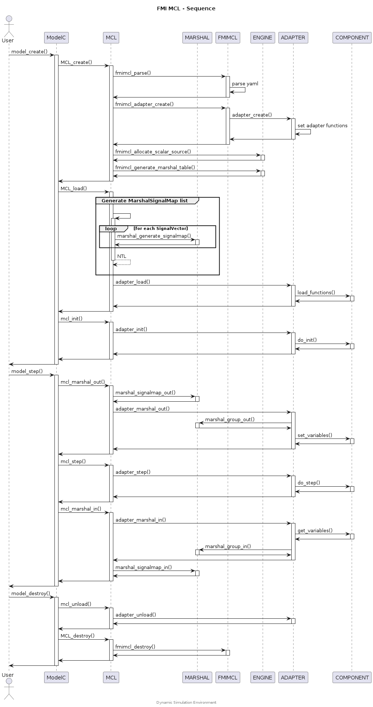

## FMI Model Compatibility Library


The FMI Model Compatibility Library provides an interfaces for loading and
operating FMUs.


### Sequence Diagram

<div hidden>

```
@startuml fmimcl-sequence

title FMI MCL - Sequence

actor       User
participant ModelC
participant MCL
participant MARSHAL
participant FMIMCL
participant ENGINE
participant ADAPTER
participant COMPONENT

User -> ModelC : model_create()
activate ModelC
ModelC -> MCL : MCL_create()
activate MCL

MCL -> FMIMCL : fmimcl_parse()
activate FMIMCL
FMIMCL -> FMIMCL : parse yaml
FMIMCL -> MCL
deactivate FMIMCL

MCL -> FMIMCL : fmimcl_adapter_create()
activate FMIMCL

FMIMCL -> ADAPTER : adapter_create()
activate ADAPTER
ADAPTER -> ADAPTER : set adapter functions
ADAPTER -> FMIMCL
deactivate ADAPTER

FMIMCL -> MCL
deactivate FMIMCL

MCL-> ENGINE: fmimcl_allocate_scalar_source()
activate ENGINE
ENGINE-> MCL
deactivate ENGINE

MCL-> ENGINE: fmimcl_generate_marshal_table()
activate ENGINE
ENGINE-> MCL
deactivate ENGINE

MCL -> ModelC
deactivate MCL

ModelC -> MCL : MCL_load()
activate MCL
group Generate MarshalSignalMap list
|||
MCL -> MCL++
loop for each SignalVector
MCL -> MARSHAL : marshal_generate_signalmap()
activate MARSHAL
MARSHAL -> MCL
deactivate MARSHAL
end
return NTL
|||
end
MCL -> ADAPTER : adapter_load()
activate ADAPTER
ADAPTER -> COMPONENT : load_functions()
activate COMPONENT
COMPONENT -> ADAPTER
deactivate COMPONENT
ADAPTER -> MCL
deactivate ADAPTER
MCL -> ModelC
deactivate MCL

ModelC -> MCL : mcl_init()
activate MCL
MCL -> ADAPTER : adapter_init()
activate ADAPTER
ADAPTER -> COMPONENT : do_init()
activate COMPONENT
COMPONENT -> ADAPTER
deactivate COMPONENT
ADAPTER -> MCL
deactivate ADAPTER
MCL -> ModelC
deactivate MCL
ModelC -> User
deactivate ModelC

User -> ModelC : model_step()
activate ModelC
ModelC -> MCL : mcl_marshal_out()
activate MCL
MCL -> MARSHAL : marshal_signalmap_out()
activate MARSHAL
MARSHAL -> MCL
deactivate MARSHAL
MCL -> ADAPTER : adapter_marshal_out()
activate ADAPTER
ADAPTER -> MARSHAL : marshal_group_out()
activate MARSHAL
MARSHAL -> ADAPTER
deactivate MARSHAL
ADAPTER -> COMPONENT : set_variables()
activate COMPONENT
COMPONENT -> ADAPTER
deactivate COMPONENT
ADAPTER -> MCL
deactivate ADAPTER
MCL -> ModelC
deactivate MCL

ModelC -> MCL : mcl_step()
activate MCL
MCL -> ADAPTER : adapter_step()
activate ADAPTER
ADAPTER -> COMPONENT : do_step()
activate COMPONENT
COMPONENT -> ADAPTER
deactivate COMPONENT
ADAPTER -> MCL
deactivate ADAPTER
MCL -> ModelC
deactivate MCL

ModelC -> MCL : mcl_marshal_in()
activate MCL
MCL -> ADAPTER : adapter_marshal_in()
activate ADAPTER
ADAPTER -> COMPONENT : get_variables()
activate COMPONENT
COMPONENT -> ADAPTER
deactivate COMPONENT
ADAPTER -> MARSHAL : marshal_group_in()
activate MARSHAL
MARSHAL -> ADAPTER
deactivate MARSHAL
ADAPTER -> MCL
deactivate ADAPTER
MCL -> MARSHAL : marshal_signalmap_in()
activate MARSHAL
MARSHAL -> MCL
deactivate MARSHAL
MCL -> ModelC
deactivate MCL
ModelC -> User
deactivate ModelC

User -> ModelC : model_destroy()
activate ModelC
ModelC -> MCL : mcl_unload()
activate MCL
MCL -> ADAPTER : adapter_unload()
activate ADAPTER
ADAPTER -> MCL
deactivate ADAPTER
MCL -> ModelC
deactivate MCL

ModelC -> MCL : MCL_destroy()
activate MCL
MCL -> FMIMCL: fmimcl_destroy()
activate FMIMCL
FMIMCL-> MCL
deactivate FMIMCL
MCL -> ModelC
deactivate MCL
ModelC -> User
deactivate ModelC

center footer Dynamic Simulation Environment

@enduml
```

</div>




## mcl_create


Create an instance of the MCL which will then be used to operate the Model that
the MCL represents.

### Parameters

model (ModelDesc*)
: Model descriptor object.

### Returns

MclDesc (pointer)
: Object representing the MCL Model, an extended ModelDesc type (derived from
parameter `model`).

NULL
: The MCL Model could not be created. Inspect `errno` for more details.

### Error Conditions


Available by inspection of `errno`.


## mcl_destroy


Releases memory and system resources allocated by `mcl_create()`.

### Parameters

model (ModelDesc*)
: Model descriptor object.


## Typedefs

### FmuData

```c
typedef struct FmuData {
    int count;
    const char** name;
    struct {
        double* scalar;
        void** binary;
    } binary_len;
    int* kind;
    int* mg_table;
}
```

### FmuModel

```c
typedef struct FmuModel {
    int mcl;
    const char* name;
    const char* version;
    int cosim;
    const char* guid;
    const char* resource_dir;
    const char* path;
    const char* handle;
    FmuSignal* signals;
    void* m_doc;
    void* adapter;
    FmuData data;
    struct {
        char* file_name;
        void* file;
        int* cg;
        int mdf;
    } measurement;
}
```

### FmuSignal

```c
typedef struct FmuSignal {
    const char* name;
    uint32_t variable_vref;
    const char* variable_name;
    int variable_kind;
    int variable_dir;
    int variable_type;
    const char* variable_annotation_encoding;
}
```

## Functions

### fmimcl_adapter_create

This method creates an adapter object based on the configuration in the FMU
Model object.

#### Parameters

fmu_model (FmuModel*)
: FMU Model descriptor object.

#### Returns

0 (int32_t)
: The related adapter was loaded by the fmimcl.

-EINVAL (-22)
: No matching adapter found.


### fmimcl_allocate_source

For each Signal parsed from the Signalgroup, this function creates an
intermediate signal object for mapping between SignalVector and FMU Variable.

#### Parameters

fmu_model (FmuModel*)
: FMU Model descriptor object.


### fmimcl_destroy

Releases memory and system resources allocated by
FMI Model Compatibility Library.

#### Parameters

fmu_model (FmuModel*)
: FMU Model descriptor object.


### fmimcl_generate_marshal_table

The FMU Signals are sorted according to the marshal groups. A source
vector is already allocated of N signals. This function will create
a marshal table, which is a mapping from the vector to a sequential list
of signal blocks, each representing a marshal group.

#### Parameters

fmu_model (FmuModel*)
: FMU Model descriptor object.


### fmimcl_load_encoder_funcs

Parse the MarshalGroup NTL and for each Kind which supports an encoder
function attempt to load the configured encoder functions to:

*    .functions.string_encode
*    .functions.string_decode

#### Parameters

fmu_model (FmuModel*)
: FMU Model descriptor object.


### fmimcl_parse

This function parses the given yaml files into a FMU Model descriptor object
and into a mapping list between the signals and FMU variables.

#### Parameters

fmu_model (FmuModel*)
: FMU Model descriptor object.


