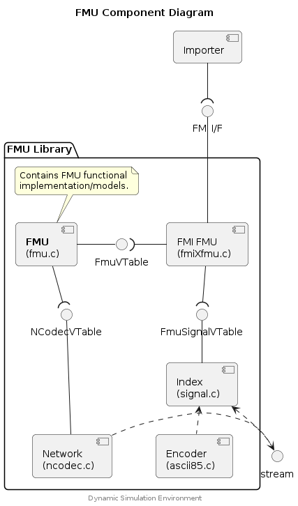

## fmi2GetString


Get values for the provided list of value references.

### Parameters

c (fmi2Component*)
: An FmuInstanceData object representing an instance of this FMU.

vr (fmi2ValueReference[])
: List of value references to retrieve.

nvr (int)
: The number of value references to retrieve.

value (fmi2String[])
: Storage for the retrieved values.

### Returns

fmi2OK (fmi2Status)
: The requested variables are retrieved (where available).


## fmi2SetReal


Set values for the provided list of value references and values.

### Parameters

c (fmi2Component*)
: An FmuInstanceData object representing an instance of this FMU.

vr (fmi2ValueReference[])
: List of value references to set.

nvr (int)
: The number of value references to set.

value (fmi2Real[])
: Storage for the values to be set.

### Returns

fmi2OK (fmi2Status)
: The requested variables have been set (where available).


## fmi2FreeInstance


Free memory and resources related to the provided FMU instance.

### Parameters

c (fmi2Component*)
: An FmuInstanceData object representing an instance of this FMU.


## FMU API


The FMU API provides a simplified FMU inteface with an abstracted variable
interface (indexing and storage). The FMU Interface includes the methods:
* Implemented by FMU developer:
    * `[fmu_create()]()`
    * `[fmu_init()]()`
    * `[fmu_step()]()`
    * `[fmu_destroy()]()`
* Additional provided functions:
    * `[fmu_log()]()` - logging function
* Supporting Variable Table mechanism:
    * `[fmu_register_var()]()`
    * `[fmu_register_var_table()]()`
    * `[fmu_var_table()]()`


An additional FMU Signal Interface is available for more complex integrations:
* `[fmu_signals_reset()]()`
* `[fmu_signals_setup()]()`
* `[fmu_signals_remove()]()`


FMUs implemented using this simplified FMU API can be built for both FMI 2
and FMI 3 standards by linking to the relevant implementations:
* `fmi2fmu.c` for and FMI 2 FMU
* `fmi3fmu.c` for and FMI 3 FMU


Binary variables are supported for FMI 3 and FMI 2 standards.
In FMUs built to the FMI 2 standard, binary variables are implemented via
FMI String Variables and an associated encoding.
See [Dynamic Simulation Environment - FMI Layered Standard Binary Codec
Selection](https://github.com/boschglobal/dse.standards/tree/main/modelica/fmi-ls-binary-codec)
for details.


### Component Diagram

<div hidden>

```
@startuml fmu-component

skinparam nodesep 55
skinparam ranksep 40
skinparam roundcorner 10
skinparam componentTextAlignment center

title FMU Component Diagram

component "Importer" as importer
interface "FMI I/F" as fmi
package "FMU Library" {
        component "FMI FMU\n(fmiXfmu.c)" as fmiXfmu
        component "**FMU**\n(fmu.c)" as fmu
        interface "FmuVTable" as fmuVt
        component "Index\n(signal.c)" as index
        interface "FmuSignalVTable" as signalVt
        component "Encoder\n(ascii85.c)" as encoder
        component "Network\n(ncodec.c)" as network
        interface "NCodecVTable" as ncodec
        note as N_fmu
  Contains FMU functional
  implementation/models.
end note

fmu .up. N_fmu
}

importer -down-( fmi
fmi --down- fmiXfmu
fmiXfmu -left-( fmuVt
fmuVt -left- fmu
fmiXfmu -down-( signalVt
signalVt -down- index
stream .up.> index
encoder .up.> index
network .right.> stream
fmu -down-( ncodec
ncodec --- network


center footer Dynamic Simulation Environment

@enduml
```

</div>




### Example


The following example demonstrates an FMU which implements an incrementing
counter.




## fmi2ExitInitializationMode


Initialise the Model Runtime (of the ModelC library) and in the process
establish the simulation that this ModelC FMU is wrapping/operating.

This function will generate indexes to map between FMI Variables and ModelC
Signals; both scaler signals (double) and binary signals (string/binary).

### Parameters

c (fmi2Component*)
: An FmuInstanceData object representing an instance of this FMU.

### Returns

fmi2OK (fmi2Status)
: The simulation that this FMU represents is ready to be operated.


## fmi2GetReal


Get values for the provided list of value references.

### Parameters

c (fmi2Component*)
: An FmuInstanceData object representing an instance of this FMU.

vr (fmi2ValueReference[])
: List of value references to retrieve.

nvr (int)
: The number of value references to retrieve.

value (fmi2Real[])
: Storage for the retrieved values.

### Returns

fmi2OK (fmi2Status)
: The requested variables are retrieved (where available).


## fmi2SetString


Set values for the provided list of value references and values. String/Binary
variables are always appended to the ModelC Binary Signal.

> Note: If several variables are indexed against the same ModelC Binary Signal,
  for instance in a Bus Topology, then each variable will be appended to that
  ModelC Binary Signal.

### Parameters

c (fmi2Component*)
: An FmuInstanceData object representing an instance of this FMU.

vr (fmi2ValueReference[])
: List of value references to set.

nvr (int)
: The number of value references to set.

value (fmi2String[])
: Storage for the values to be set.

### Returns

fmi2OK (fmi2Status)
: The requested variables have been set (where available).


## fmi2DoStep


Set values for the provided list of value references and values. String/Binary
variables are always appended to the ModelC Binary Signal.

> Note: If several variables are indexed against the same ModelC Binary Signal,
  for instance in a Bus Topology, then each variable will be appended to that
  ModelC Binary Signal.

### Parameters

c (fmi2Component*)
: An FmuInstanceData object representing an instance of this FMU.

currentCommunicationPoint (fmi2Real)
: The model time (for the start of this step).

communicationStepSize (fmi2Real)
: The model step size.

noSetFMUStatePriorToCurrentPoint (fmi2Boolean)
: Not used.

### Returns

fmi2OK (fmi2Status)
: The step completed.

fmi2Error (fmi2Status)
: An error occurred when stepping the ModelC Simulation.


## default_log


Default logging function in case the FMU caller does not provide any logger.


## fmi2Instantiate


Create an instance of this FMU, allocate/initialise a FmuInstanceData
object which should be used for subsequent calls to FMI methods (as parameter
`fmi2Component c`).

> Note: This implementation __does not__ use memory related callbacks provided
  by the Importer (e.g. `malloc()` or `free()`).

### Returns

fmi2Component (pointer)
: An FmuInstanceData object which represents this FMU instance.


## Typedefs

### FmuInstanceData

```c
typedef struct FmuInstanceData {
    struct {
        char* name;
        int type;
        int version;
        char* resource_location;
        char* guid;
        bool log_enabled;
        void* logger;
        void* environment;
        char* save_resource_location;
    } instance;
    struct {
        struct {
            int input;
            int output;
        } scalar;
        struct {
            int input;
            int output;
        } string;
        struct {
            int rx;
            int tx;
            int encode_func;
            int decode_func;
            int free_list;
        } binary;
        FmuSignalVTable vtable;
        bool signals_reset;
    } variables;
    void* data;
    struct {
        void* table;
        int var_list;
        FmuVarTableMarshalItem* marshal_list;
    } var_table;
}
```

### FmuSignalVTable

```c
typedef struct FmuSignalVTable {
    FmuSignalsResetFunc reset;
    FmuSignalsSetupFunc setup;
    FmuSignalsRemoveFunc remove;
}
```

### FmuSignalVector

```c
typedef struct FmuSignalVector {
    int index;
    uint32_t count;
    char** signal;
    uint32_t* uid;
    double* scalar;
    void** binary;
    uint32_t* length;
    uint32_t* buffer_size;
    char** mime_type;
    void** ncodec;
}
```

### FmuSignalVectorIndex

```c
typedef struct FmuSignalVectorIndex {
    FmuSignalVector* sv;
    uint32_t vi;
}
```

### FmuVTable

```c
typedef struct FmuVTable {
    FmuCreateFunc create;
    FmuInitFunc init;
    FmuStepFunc step;
    FmuDestroyFunc destroy;
}
```

### FmuVarTableMarshalItem

```c
typedef struct FmuVarTableMarshalItem {
    double* variable;
    double* signal;
}
```

## Functions

### fmu_create

This method creates a FMU specific instance which will be used to operate the
FMU. It is called in the `Instantiate()` method of the FMI standard.

Fault conditions can be communicated to the caller by setting variable
`errno` to a non-zero value.

> Implemented by FMU.

#### Parameters

fmu (FmuInstanceData*)
: The FMU Descriptor object representing an instance of the FMU Model.

#### Returns

NULL
: The FMU was configured.

(FmuInstanceData*)
: Pointer to a new, or mutilated, version of the Fmu Descriptor object. The
  original Fmu Descriptor object will be released by the higher layer (i.e.
  don't call `free()`).

errno <> 0 (indirect)
: Indicates an error condition.


### fmu_destroy

Releases memory and system resources allocated by FMU.
It is called in the `FreeInstance()` Method of the FMU.

> Implemented by FMU.

#### Parameters

fmu (FmuInstanceData*)
: The FMU Descriptor object representing an instance of the FMU Model.

#### Returns

0 (int32_t)
: The FMU data was released correctly.


### fmu_init

This method initializes all FMU relevant data that is represented by the FMU.
It is called in the `ExitInitializationMode()` Method of the FMU.

> Implemented by FMU.

#### Parameters

fmu (FmuInstanceData*)
: The FMU Descriptor object representing an instance of the FMU Model.

#### Returns

0 (int32_t)
: The FMU was created correctly.


### fmu_load_signal_handlers

This method assigns the signal handler function to a vtable.

#### Parameters

fmu (FmuInstanceData*)
: The FMU Descriptor object representing an instance of the FMU Model.


### fmu_log

Write a log message to the logger defined by the FMU.

#### Parameters

fmu (FmuInstanceData*)
: The FMU Descriptor object representing an instance of the FMU Model.

status (const int)
: The status of the message to be logged.

category (const char*)
: The category the message belongs to.

message (const char*)
: The message to be logged by the FMU.


### fmu_lookup_ncodec

Lookup and existing NCODEC object which represents a binary (or string)
variable of the FMU.

#### Parameters

fmu (FmuInstanceData*)
: The FMU Descriptor object representing an instance of the FMU Model.
vref (uint32_t)
: Variable reference of the variable with an associated NCODEC object.
input (bool)
: Set `true` for input, and `false` for output variable causality.

#### Returns

void* (NCODEC pointer)
: A valid NCODEC object for the underlying variable.


### fmu_register_var

Register a variable with the FMU Variable Table mechanism.

#### Parameters

fmu (FmuInstanceData*)
: The FMU Descriptor object representing an instance of the FMU Model.
vref (uint32_t)
: Variable reference of the variable being registered.
input (bool)
: Set `true` for input, and `false` for output variable causality.
offset (size_t)
: Offset of the variable (type double) in the FMU provided variable table.

#### Returns

start_value (double)
: The configured FMU Variable start value, or 0.


### fmu_register_var_table

Register the Variable Table. The previously registered variables, via calls to
`fmu_register_var`, are configured and the FMU Variable Table mechanism
is enabled.

#### Parameters

fmu (FmuInstanceData*)
: The FMU Descriptor object representing an instance of the FMU Model.
table (void*)
: Pointer to the Variable Table being registered.


### fmu_signals_remove

This method will remove any buffers used to provide storage for FMU variables.
If those buffers were allocated (e.g by an implementation
of `fmu_signals_setup()`) then those buffers should be freed in this method.

> Integrators may provide their own implementation of this method.

#### Parameters

fmu (FmuInstanceData*)
: The FMU Descriptor object representing an instance of the FMU Model.


### fmu_signals_reset

This method will reset any binary variables which where used by an FMU in the
previous step. Typically this will mean that indexes into the buffers of
binary variables are set to 0, however the buffers themselves are
not released (i.e. free() is not called).

> Integrators may provide their own implementation of this method.

#### Parameters

fmu (FmuInstanceData*)
: The FMU Descriptor object representing an instance of the FMU Model.


### fmu_signals_setup

This method will setup the buffers which provide storage for FMU variables.
Depending on the implementation buffers may be mapped to existing buffers
in the implementation, or allocated specifically. When allocating buffers the
method `fmu_signals_setup()` should also be implemented to release those buffers
when the `FmuInstanceData()` is freed.

> Integrators may provide their own implementation of this method.

#### Parameters

fmu (FmuInstanceData*)
: The FMU Descriptor object representing an instance of the FMU Model.


### fmu_step

This method initializes all FMU relevant data that is represented by the FMU.
It is called in the `DoStep()` Method of the FMU.

> Implemented by FMU.

#### Parameters

fmu (FmuInstanceData*)
: The FMU Descriptor object representing an instance of the FMU Model.
communication_point (double)
: The current model time of the FMU in seconds.
step_size (double)
: The step size of the FMU in seconds.

#### Returns

0 (int32_t)
: The FMU step was performed correctly.


### fmu_var_table

Return a reference to the previously registered Variable Table.

#### Parameters

fmu (FmuInstanceData*)
: The FMU Descriptor object representing an instance of the FMU Model.

#### Returns

table (void*)
: Pointer to the Variable Table.


