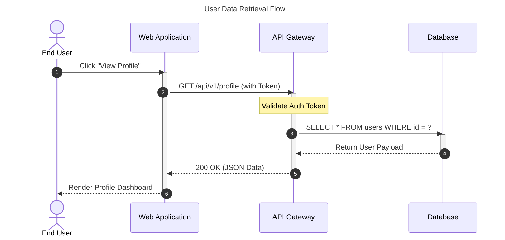
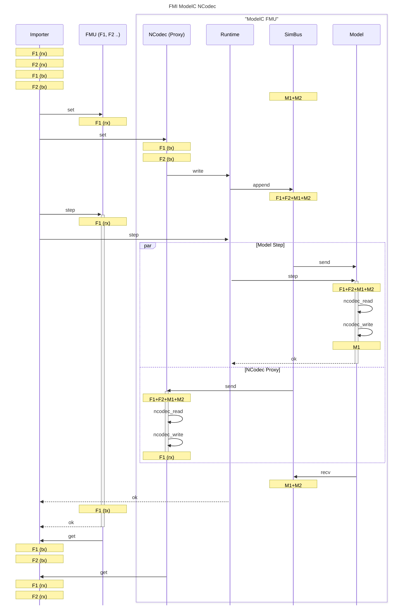

# de

```mermaid
sequenceDiagram
    autonumber
    title User Data Retrieval Flow

    %% Define the 4 nodes explicitly
    actor User as End User
    participant WebApp as Web Application
    participant Gateway as API Gateway
    participant DB as Database

    %% Message exchange sequence
    User->>WebApp: Click "View Profile"
    activate WebApp

    WebApp->>Gateway: GET /api/v1/profile (with Token)
    activate Gateway

    Note over Gateway: Validate Auth Token

    Gateway->>DB: SELECT * FROM users WHERE id = ?
    activate DB
    DB-->>Gateway: Return User Payload
    deactivate DB

    Gateway-->>WebApp: 200 OK (JSON Data)
    deactivate Gateway

    WebApp-->>User: Render Profile Dashboard
    deactivate WebApp
```

## bar

```mermaid
%%{init: {
  'theme': 'default',
  'sequence': {
    'messageMargin': 2,
    'boxTextMargin': 2,
    'noteMargin': 4,
    'mirrorActors': false
  }
}}%%
sequenceDiagram
    title FMI ModelC NCodec

    %% nodes
    participant Importer as Importer
    participant FMU as FMU (F1, F2 ..)
    box "ModelC FMU"
        participant NCodec as NCodec (Proxy)
        participant Runtime as Runtime
        participant SimBus as SimBus
        participant Model as Model
    end

    Note over Importer: F1 (rx)
    Note over Importer: F2 (rx)
    Note over Importer: F1 (tx)
    Note over Importer: F2 (tx)

    Note over SimBus: M1+M2

    Importer->>FMU: set
    Note over FMU: F1 (rx)
    Importer->>NCodec: set
    Note over NCodec: F1 (tx)
    Note over NCodec: F2 (tx)
    NCodec->>Runtime: write
    Runtime->>SimBus: append
    Note over SimBus: F1+F2+M1+M2


    Importer->>+FMU: step
    Note over FMU: F1 (rx)
    Importer->>+Runtime: step

    par Model Step
        SimBus->>Model: send
        Runtime->>+Model: step
        Note over Model: F1+F2+M1+M2
        Model->>Model: ncodec_read
        Model->>Model: ncodec_write
        Note over Model: M1
        Model-->>-Runtime: ok
    and NCodec Proxy
        SimBus->>NCodec: send
        activate NCodec
        Note over NCodec: F1+F2+M1+M2
        NCodec->>NCodec: ncodec_read
        NCodec->>NCodec: ncodec_write
        Note over NCodec: F1 (rx)
        deactivate NCodec
    end
    Model->>SimBus: recv
    Note over SimBus: M1+M2


    Runtime-->>Importer: ok
    Note over FMU: F1 (tx)
    FMU-->>-Importer: ok

    FMU->>Importer: get
    Note over Importer: F1 (tx)
    Note over Importer: F2 (tx)
    NCodec->>Importer: get
    Note over Importer: F1 (rx)
    Note over Importer: F2 (rx)

```