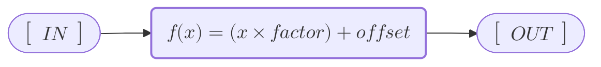

# FMI ModelC FMU with Direct Indexing

## Model



### Parameters

| Parameter         | Envar               | Default Value |
| :---              | :---                | :---:         |
| <var>factor</var> | <code>FACTOR</code> | 1             |
| <var>offset</var> | <code>OFFSET</code> | 0             |


## Packaging

The example builds a Simer Layout simulation which is then processed by the `generate-modelcfmu` workflow to create the ModelC FMU which contains the packaged simulation. This FMU can be operated with an FMU Importer.

```text
examples/direct
    └── sim
    │   ├── data
    │   │    └── simulation.yml
    │   │    └── direct_index.yml           <-- Workflow generated direct index (SignalGroup).
    │   └── model
    │       └── direct
    │           └── lib/libdirect.so
    │           └── data/model.yml
    └── fmu
        └── direct/                         <-- Packaged FMU layout (can be directly operated).
        └── direct.fmu                      <-- FMU archive file.
```

## Operation

> __HINT:__ Workflows are partly operated by environment variables. Careful selection of variable names is necessary to avoid conflict with those used by the workflows.


### Direct testing of the Example

```bash
# Build the example.
$ make
$ make package

# Optionally build workflows and setup to use local images.
$ make build fmi tools
$ export FMI_IMAGE=fmi:test
$ export SIMER_IMAGE=simer:test

# Setup some paths.
$ export REPO_DIR=$(pwd)
$ export DIRECT_SIM_DIR=$(pwd)/dse/build/_out/examples/direct/sim
$ export MODEL_PATH=model/direct

# Patch the model lib locations.
$ find $DIRECT_SIM_DIR/$MODEL_PATH/data -type f -name model.yaml -print0 | xargs -r -0 yq -i 'with(.spec.runtime.dynlib[]; .path |= sub(".*/(.*$)", "'"$MODEL_PATH"'/lib/${1}"))'


# Run the workflows.
$ (cd $DIRECT_SIM_DIR; task --taskfile $REPO_DIR/Taskfile.yml generate-modelcfmu SIM=. FMU_NAME=direct SIGNAL_GROUPS=in_vector,out_vector INDEX=true)

# Run the simulation using the FMU Importer.
$ export IMPORTER=dse/build/_out/importer/fmuImporter
$ export FMU_DIR=dse/build/_out/examples/direct/fmu/direct
$ $IMPORTER --verbose --steps=10 $FMU_DIR

# Enable debug
$ export SIMBUS_LOGLEVEL=1

# Run with GDB
$ gdb -q -ex='set confirm on' -ex=run -ex=quit --args $IMPORTER --verbose --steps=10 $FMU_DIR
```


### Testing of the E2E Test

> __INFO:__ The following operation is reflected an [E2E Test][e2e_test].


```bash
# Build the example.
$ make
$ make package

# Build workflows and setup to use local images.
$ make build fmi tools
$ export FMI_IMAGE=fmi:test
$ export SIMER_IMAGE=simer:test  # (optional, for when issues in dse.modelc need testing too)

# Adjust Makefile
#   TESTSCRIPT_E2E_FILES = $(wildcard $(TESTSCRIPT_E2E_DIR)/direct*.txtar)

# Set additional debug for simer (txtar:test.sh)
#   -e SIMBUS_LOGLEVEL=1

# Run the test.
$ make test_e2e

# Check especially labels on signal groups.

```


[e2e_test]: https://github.com/boschglobal/dse.fmi/blob/main/tests/testscript/e2e/direct_index.txtar
